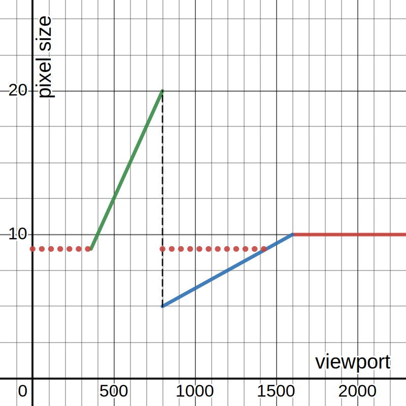

# Css

```sh
npm i @288-toolkit/css
```

A collection of useful css files. Must be used with Tailwindcss.

## `viewport.css`

Makes `rem` units responsive between 2 viewport sizes.

When the viewport is below the `min`, 1 rem equals 9px, which is the smallest value allowed by
Safari.

When the viewport is above the `max`, 1 rem equals 10px.

When the viewport is between `min` and `max`, 1 rem is tied to the viewport width. The scaling
factor changes at one breakpoint between `min` and `max`, called `bp`.

[](https://www.desmos.com/calculator/dhkjr16m9c)

Between `min` and `--viewport-bp`, which is 800 by default, 1 rem equals `2vw`. Between
`--viewport-bp` and `--viewport-max`, which is 1600 by default, 1 rem equals `1vw`.

For the styles to work properly, you must define those 3 points in your tailwind config screens.

We recommend the following values.

```ts
export default {
	theme: {
		screens: {
			min: '360px',
			bp: '800px',
			max: '1600px
		}
	}
}
```

Note that if you modify `bp` or `max`, you must also set the same value in their respective css
variables on the `:root`.

```ts
export default {
	theme: {
		screens: {
			min: '360px',
			bp: '1000px',
			max: '1800px
		}
	}
}
```

```css
:root {
	--viewport-bp: 1000;
	--viewport-max: 1800;
}
```

## `reset.css`

A css reset, added on top of Tailwind's own preflight.css.
